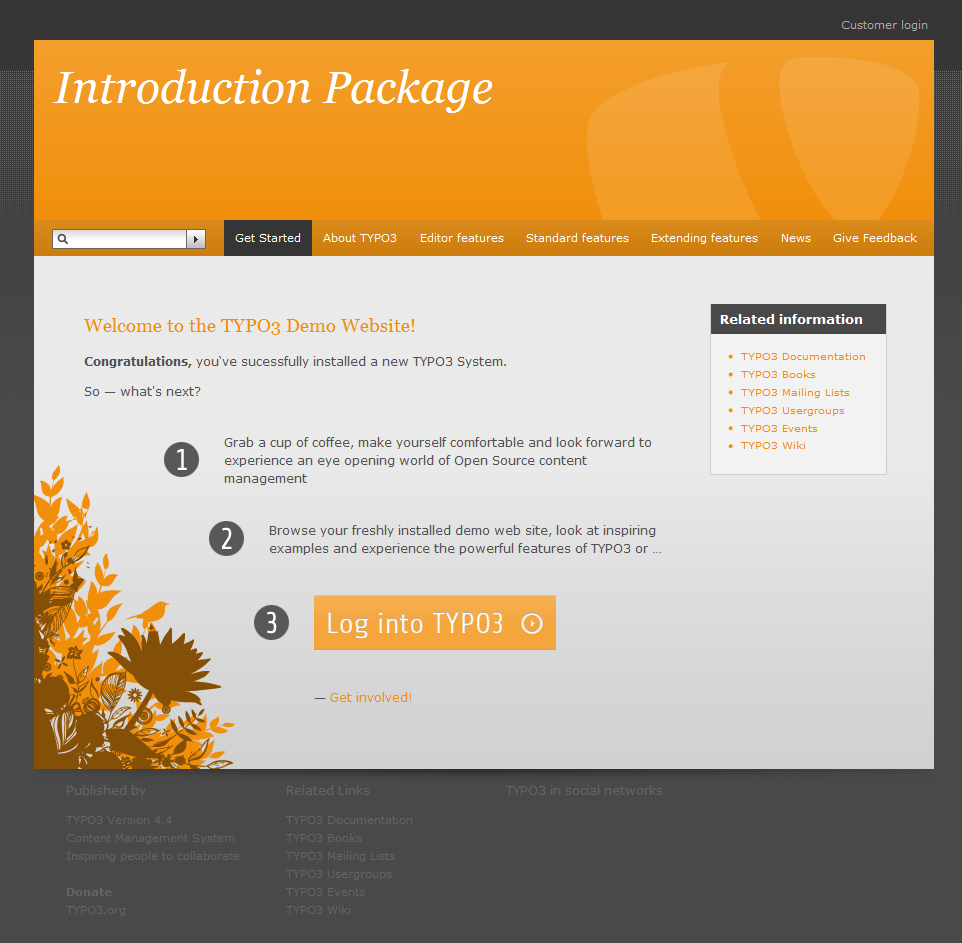

..  Editor configuration
	...................................................
	* utf-8 with BOM as encoding
	* tab indent with 4 characters for code snippet.
	* optional: soft carriage return preferred.

.. Includes roles, substitutions, ...
.. include:: _IncludedDirectives.rst

=================
Placement Service
=================

:Extension name: Placement Service
:Extension key: placements
:Version: 0.8.0-dev
:Description: manuals covering TYPO3 extension "Placement Service"
:Language: en
:Author: Dirk Wenzel, Michael Kasten
:Creation: 2014-03-25
:Generation: 15:50
:Licence: Open Content License available from `www.opencontent.org/opl.shtml <http://www.opencontent.org/opl.shtml>`_

The content of this document is related to TYPO3, a GNU/GPL CMS/Framework available from `www.typo3.org
<http://www.typo3.org/>`_

**Table of Contents**

.. toctree::
	:maxdepth: 2

	ProjectInformation
	UserManual
	AdministratorManual
	TyposcriptReference
	DeveloperCorner
	RestructuredtextHelp

.. STILL TO ADD IN THIS DOCUMENT
	@todo: add section about how screenshots can be automated. Pointer to PhantomJS could be added.
	@todo: explain how documentation can be rendered locally and remotely.
	@todo: explain what files should be versionned and what not (_build, Makefile, conf.py, ...)

.. include:: ../Readme.rst

What does it do?
=================
Placements Service aims to be a complete and comfortable tool for managing job offers and applications.
It suitable for small and medium sized companies as well as for bigger organizations or employment service provider.

Jobs offers can be managed through the TYPO3 backend or the frontend. They are displayed in list and single view. Both views can be configured to show a Google map with job offers. 
A highly configurable menu allows filtering the search results by type, sector, working time or search word. It also features a radius search for a given location.

Registrated users may add, edit or remove job offers and organizations in frontend. A fine grained access controll service provides multi-client capability too.

Future releases of these extension will include messaging about new jobs and application, match making and editable user profiles.

		Introduction Package just after installation (caption of the image)

		How the Frontend of the Introduction Package looks like just after installation (legend of the image)
